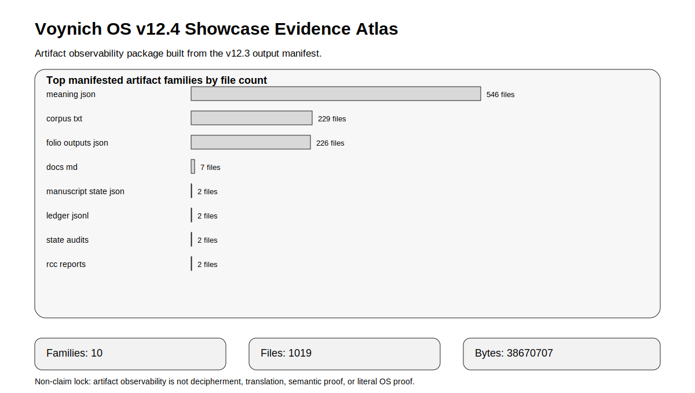

# Voynich OS v12.4 - Visual Showcase Atlas

## Atlas purpose

The atlas compresses the v12.3 output manifest into a human-readable demonstration surface.

## Atlas interpretation

The chart shows manifested artifact-family scale. It is a repository-observability chart, not a decipherment chart.

## Reading rule

A taller artifact family means more generated/recorded files in that family. It does not mean higher truth, higher semantic validity, or stronger manuscript interpretation.

## Non-claim lock

Visual evidence is not semantic proof. Charts improve observability, not decipherment.
